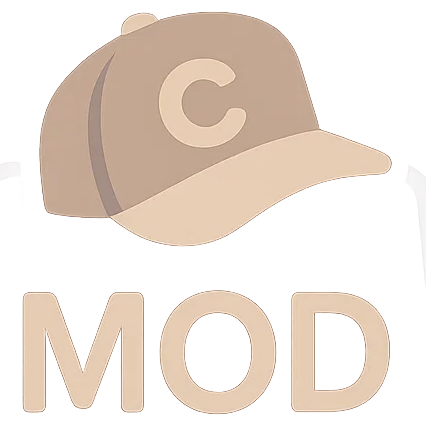

# CapslockMOD

CapslockMOD is an AutoHotkey script that turns your Caps Lock key into a handy modifier key.

---

## Features

- Maps Caps Lock + keys to Norwegian letters (æ, ø, å, é).  
- Shortcut to rerun last command
- RustRover-specific shortcuts for common Cargo commands like `cargo run`, `cargo test`, `cargo build`, and more.  
- Easily extensible
- Quick tap Caps Lock sends Escape (who uses capslock anyways)
- Shortcuts only work when the right window is active.  

---

## Usage

1. **Requirements:**  
   - Windows  
   - AutoHotkey (only if you want to customize the script)

2. **Setup:**  
   - Clone or download the repo.  
   - Run the script or compile it to an EXE for easy use. (You can also download prebuilt binary)

3. **Customization:**  
   - Add or change shortcuts in separate `.ahk` files for different apps.  
   - Edit global shortcuts in `globalShortcuts.ahk`.  
   - Update detection functions to add support for other programs (like CLion, VSCode).

---

## RustRover shortcuts example

- `CapsLock + r` → `cargo run`  
- `CapsLock + t` → `cargo test`  
- `CapsLock + c` → `cargo clippy`  
- `CapsLock + d` → `cargo doc --open`  
- `CapsLock + b` → `cargo build`  
- `CapsLock + m` → `cargo check`  
- `CapsLock + x` → `cargo clean`  
- `CapsLock + u` → `cargo update`

---

## Contributing

Feel free to open issues or pull requests if you want to add stuff or fix bugs.

---

## License

MIT License — see the [LICENSE](LICENSE) file.

---

Made by Peter V. Andersson
