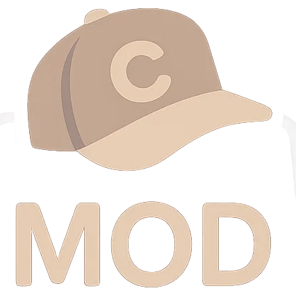
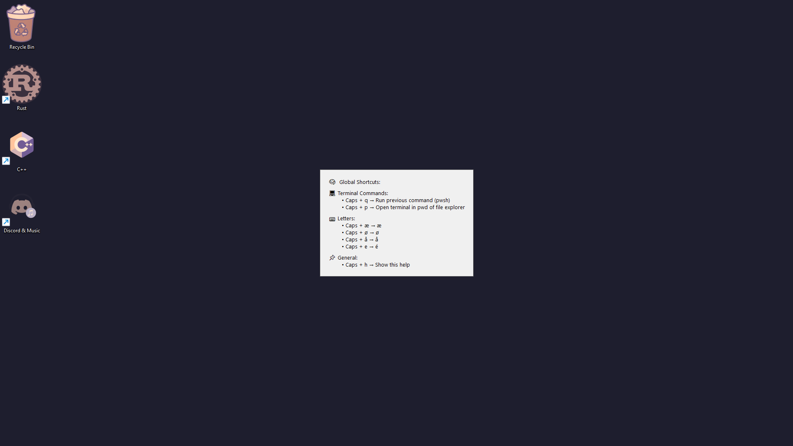
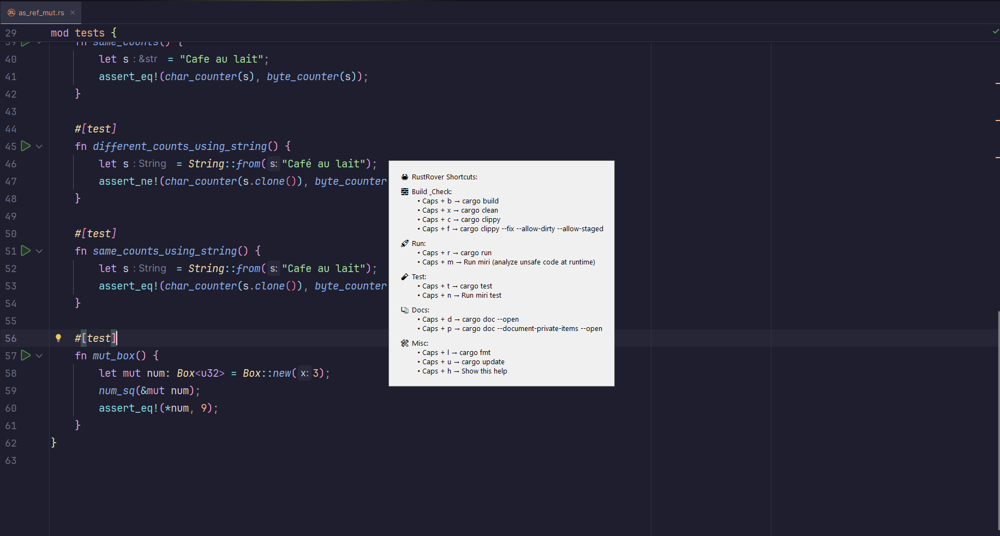

# CapslockMOD

CapslockMOD is an AutoHotkey script that turns your Caps Lock key into a handy modifier key.

---

## Features

- Maps Caps Lock + keys to custom actions (or commands) 
- RustRover-specific shortcuts for common Cargo commands like `cargo run`, `cargo test`, `cargo build`, and more.  
- Quick tap Caps Lock sends Escape (who uses capslock anyways)
- Shortcuts only work when the right window is active. 
- Help menu with caps + h (click the window or press ESC to close)

---

## Usage

1. **Requirements:**  
   - Windows  
   - AutoHotkey (only if you want to customize the script)

2. **Setup:**  
   - Clone or download the repo.  
   - Run the script or compile it to an EXE for easy use. (You can also download prebuilt binary)

3. **Customization:**  
   - Add or change shortcuts in separate `.ahk` files for different apps.  
   - Edit global shortcuts in `globalShortcuts.ahk`.  
   - Update detection functions to add support for other programs (like CLion, VSCode).
   - Take a look at rustShortcuts.ahk for inspiration

---

## Global shortcuts help menu

---

## RustRover shortcuts help menu

---

## Contributing

Feel free to open issues or pull requests if you want to add stuff or fix bugs.

---

## License

MIT License

